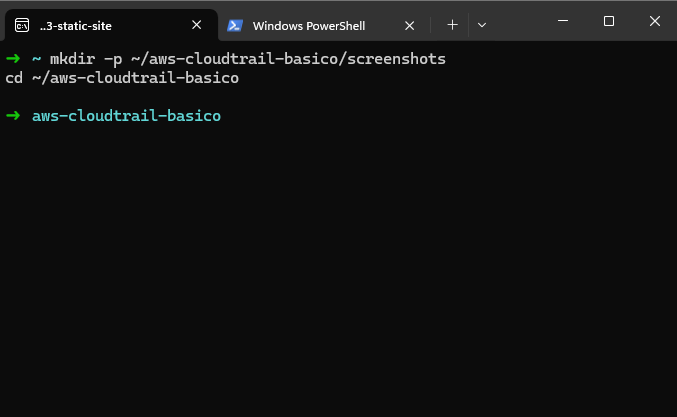
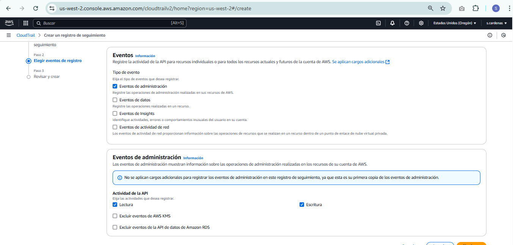
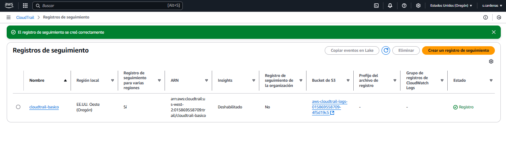
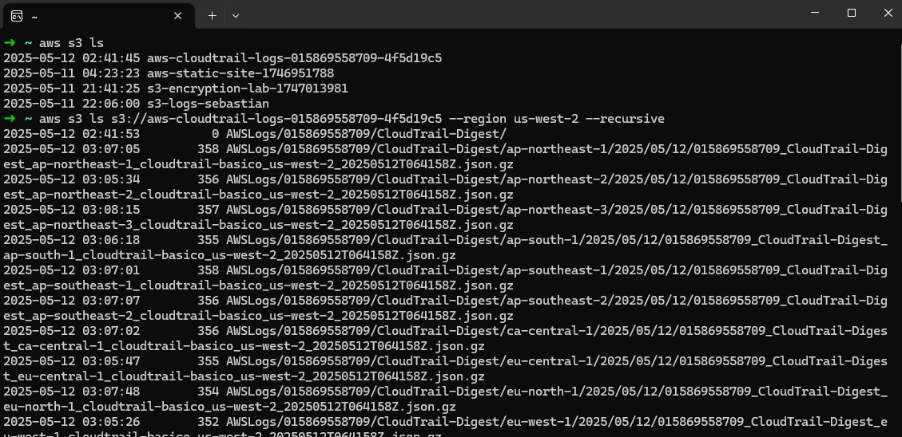

# 📜 AWS CloudTrail – Registro básico de eventos

Este proyecto demuestra cómo configurar un trail básico con **AWS CloudTrail** para registrar eventos de administración y validar su almacenamiento en un bucket S3. Forma parte de una serie práctica enfocada en **ciberseguridad en la nube**, específicamente en auditoría de accesos y acciones dentro del entorno AWS.

---

## 🧰 Servicios y herramientas utilizadas

- **AWS CloudTrail** – Servicio de registro y auditoría de acciones
- **Amazon S3** – Almacenamiento de logs generados por el trail
- **AWS CLI** – Validación de logs desde la terminal
- **Linux/WSL2** – Entorno de desarrollo con Ubuntu
- **Git + GitHub** – Control de versiones y documentación

---

## 📁 Estructura del proyecto

```plaintext
aws-cloudtrail-basico/
├── screenshots/
│   ├── 01-estructura-inicial.png
│   ├── 02-configurar-cloudtrail-basico.png
│   ├── 03-eventos-administracion-habilitados.png
│   ├── 04-trail-creado-exitosamente.png
│   └── 05-verificar-logs-generados.png
└── README.md
```

---

## 🚀 Pasos realizados

1. Crear estructura de carpetas local para el laboratorio.
2. Configurar un trail en CloudTrail, eligiendo:
   - Registro de eventos de administración.
   - Actividad de lectura y escritura.
   - Crear un nuevo bucket S3 para almacenar los logs.
3. Validar que el trail se creó correctamente en la consola de CloudTrail.
4. Verificar que los logs se estén generando correctamente usando `aws s3 ls`.
5. Documentar el proceso con capturas y subirlo a GitHub.

---

## 📸 Capturas del proceso

### 1️⃣ Estructura inicial del proyecto local


### 2️⃣ Configuración del trail básico en CloudTrail


### 3️⃣ Eventos de administración habilitados


### 4️⃣ Trail creado exitosamente en consola


### 5️⃣ Verificación de logs generados en el bucket S3


---

## 📍 Resultado

Trail funcional activo, registros auditados correctamente y proyecto documentado para incluirse como evidencia en portafolio técnico de seguridad en la nube.

---

## 👤 Autor

**Sebastián Cárdenas**  
*Aspirante a AWS Cloud Practitioner | Estudiante de Ingeniería en Ciberseguridad*

📫 Contacto: [sebastian.cardenas.t@gmail.com](mailto:sebastian.cardenas.t@gmail.com)
